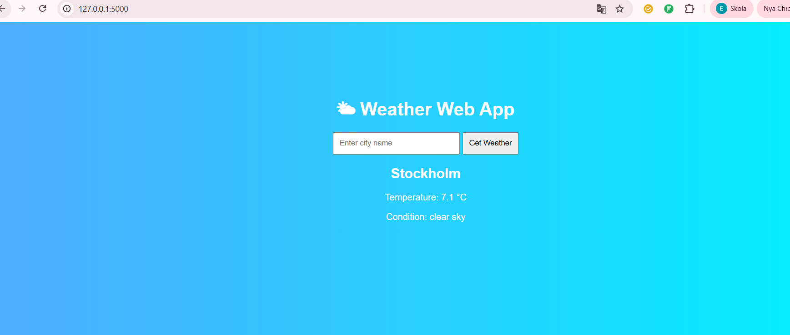

# 🌤 Weather Web App

A simple Flask-based weather application that fetches real-time weather data using the OpenWeather API.

## 🚀 Features

- Search weather by city name
- Real-time temperature
- Weather description
- Clean and simple UI
- Built with Python & Flask

## 🛠 Tech Stack

- Python
- Flask
- OpenWeather API
- HTML / Jinja2

## 📸 Screenshot

## ▶ How to Run Locally

1. Clone the repository:
   git clone https://github.com/emeliehfeldt-byte/weather-web-app.git

2. Install dependencies:
   pip install -r requirements.txt

3. Run the app:
   python app.py

4. Open in browser:
   http://127.0.0.1:5000

---

## 👩‍💻 Author

Emelie Hörnfelt  
GitHub: https://github.com/emeliehfeldt-byte
